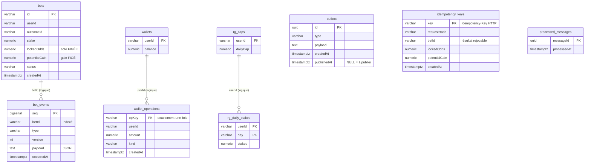

# BetNext — Modèle de données (tables) et choix de conception

> **Source de vérité de ce document** : les migrations TypeORM réelles
> (`src/**/infrastructure/persistence/migrations/*.ts` et `src/messaging/migrations/*.ts`), jouées au
> démarrage (`migrationsRun: true`) quand `DATABASE_URL` est défini. Sans `DATABASE_URL`, le POC tourne
> sur des adapters **en mémoire** iso-sémantiques (tests rapides) ; les garanties au niveau base
> décrites ici sont prouvées sur **vrai Postgres** via `npm run test:atomicity:pg` (16 cas) et les
> scripts Redis de la CI. Tous les extraits DDL ci-dessous sont copiés des migrations.

---

## 1. Principes transverses (les choix structurants)

| Choix | Détail | Pourquoi (gain / perte / condition) |
| --- | --- | --- |
| **Postgres = source de vérité** ; **Redis = cache reconstructible** | L'état et l'argent vivent en Postgres. Le read-model des cotes et l'état Pricing vivent en Redis (§7). | Gain : zéro perte d'argent garantie en base. Perte : Redis peut diverger transitoirement (cohérence éventuelle). Condition : Redis n'est **jamais** autoritatif ni utilisé pour le solde (ADR-006). |
| **1 table = 1 bounded context propriétaire** | `bets`/`bet_events`/`outbox`/`idempotency_keys` → Betting ; `wallets`/`wallet_operations` → Wallet ; `rg_caps`/`rg_daily_stakes` → Responsible Gaming ; `processed_messages` → infra messaging. | Frontières « ready-to-split » (ADR-001) : un contexte est extractible en service sans démêler ses tables. |
| **Aucune clé étrangère inter-contexte** | `userId`, `outcomeId`, `betId` sont des identifiants **logiques**, pas des `FOREIGN KEY` contraintes en base. | Gain : pas de FK distribué à casser quand Wallet/Pricing sortent en service ; la cohérence inter-contexte passe par les **events** (Outbox). Perte : pas d'intégrité référentielle DB transverse → à garantir applicativement. Condition : la couture transactionnelle (BET-5) garde l'atomicité tant que mono-DB. |
| **Argent en `numeric(14,2)`** | `stake`, `balance`, `potentialGain`, `amount`, `dailyCap`, `staked`. **Jamais** de `float`. | Évite les erreurs d'arrondi binaire sur la monnaie (exigence « zéro erreur » du défi 3). |
| **Horodatages `timestamptz`** (`createdAt`, `occurredAt`, …) | Stockés en UTC. | Cohérence temporelle ; voir l'hypothèse « jour UTC » du plafond (§6). |
| **Migrations explicites & idempotentes** | DDL SQL écrit à la main, `CREATE ... IF NOT EXISTS`, jouées au boot. `synchronize: false`. | Schéma reproductible et auditable ; pas de drift implicite par l'ORM. |
| **Pattern « PK = clé d'idempotence »** | La PK porte la garantie *exactement-une-fois* : `processed_messages.messageId`, `idempotency_keys.key`, `wallet_operations.opKey`, et l'index unique partiel `uniq_bet_settlement_event`. | Un 2e enregistrement (rejeu / concurrence) viole la PK/l'unique → annulé par la base, pas par du code applicatif faillible. |

### Vue d'ensemble (ERD — relations **logiques**, sans FK DB)



> Les trois relations dessinées sont **logiques** (jointures applicatives par identifiant), **pas**
> des `FOREIGN KEY` : `bet_events`, `wallet_operations` et `rg_daily_stakes` ne contraignent pas en base
> l'existence de la ligne « parente », pour préserver l'indépendance des contextes.

---

## 2. Contexte **Betting**

### 2.1 `bets` — snapshot autoritatif du pari (ADR-005 / BET-6)

```sql
CREATE TABLE IF NOT EXISTS "bets" (
  "id" varchar PRIMARY KEY,
  "userId" varchar NOT NULL,
  "outcomeId" varchar NOT NULL,
  "stake" numeric(14,2) NOT NULL,
  "lockedOdds" numeric(6,2) NOT NULL,
  "potentialGain" numeric(14,2) NOT NULL,
  "status" varchar NOT NULL,
  "createdAt" timestamptz NOT NULL DEFAULT now()
);
```

**Rôle** : l'état courant (snapshot) d'un pari, lu directement (read-your-writes, BET-10).

**Choix de conception**
- **Cote ET gain FIGÉS et STOCKÉS** (`lockedOdds`, `potentialGain`) — jamais recalculés à la lecture
  (ADR-005). La cote du marché peut bouger (Pricing/Redis), le pari posé conserve la sienne. Gain :
  lecture O(1) + invariant « cote figée » trivial ; perte : redondance (le gain est dérivable de
  `stake × lockedOdds`) assumée pour la clarté et l'immuabilité.
- `status` en `varchar` (valeurs `PENDING|WON|LOST|VOID|COMPENSATING|REFUNDED`, cf. `BetStatus`) plutôt
  qu'un `enum` Postgres : éviter une migration ALTER TYPE à chaque nouveau statut (extensibilité).
- `id` `varchar` (fourni par l'application via `IdGenerator`) : l'agrégat possède son identité ; pas de
  dépendance à un auto-increment DB.
- `userId`/`outcomeId` non contraints par FK (frontières — §1).

### 2.2 `bet_events` — journal d'événements **append-only** (ADR-005 / BET-6, BET-12)

```sql
CREATE TABLE IF NOT EXISTS "bet_events" (
  "seq" bigserial PRIMARY KEY,
  "betId" varchar NOT NULL,
  "type" varchar NOT NULL,
  "version" int NOT NULL DEFAULT 1,
  "payload" text NOT NULL,
  "occurredAt" timestamptz NOT NULL DEFAULT now()
);
CREATE INDEX IF NOT EXISTS "idx_bet_events_betId" ON "bet_events" ("betId");

-- Append-only au niveau base : toute UPDATE/DELETE sur le journal est rejetée.
CREATE TRIGGER "bet_events_no_mutation" BEFORE UPDATE OR DELETE ON "bet_events"
  FOR EACH ROW EXECUTE FUNCTION "betnext_bet_events_append_only"(); -- RAISE EXCEPTION
```

**Rôle** : Event Sourcing **ciblé sur le seul agrégat `Bet`** (calibrage équipe junior) : trace
immuable `BetPlaced → BetWon/BetLost/BetVoided`, audit, rejeu, et timeline affichée au joueur (BET-14).

**Choix de conception**
- **Immuabilité garantie EN BASE** par le trigger `bet_events_no_mutation` : une `UPDATE`/`DELETE` lève
  une exception. Le journal ne peut donc pas être réécrit (preuve `atomicity-pg`, cas « append-only »).
  Gain : la trace fait foi ; perte : aucune correction « en place » possible → on corrige par un
  **nouvel** event (compensation), ce qui est la sémantique attendue d'un journal.
- `seq` `bigserial` (PK) : **ordre total** des events pour le rejeu/la timeline ; `idx_bet_events_betId`
  pour relire l'historique d'un pari sans scan.
- `version` : prévu pour l'**upcasting** d'un type d'event qui évoluerait (compat ascendante).
- `payload` `text` (JSON sérialisé) : schéma d'event souple, non couplé à une colonne par champ.
- **Index unique partiel anti-doublon de règlement** (BET-12) :

  ```sql
  CREATE UNIQUE INDEX IF NOT EXISTS "uniq_bet_settlement_event"
    ON "bet_events" ("betId") WHERE "type" IN ('BetWon','BetLost','BetVoided');
  ```
  → **au plus UN event terminal par pari**. Sous règlement **concurrent** du même marché, le 2e INSERT
  d'event terminal viole l'index → sa transaction échoue → pas de double-event ni de double-crédit
  (prouvé `atomicity-pg`, cas « settlement CONCURRENT »).

### 2.3 `idempotency_keys` — idempotence HTTP de la pose (BET-18)

```sql
CREATE TABLE IF NOT EXISTS "idempotency_keys" (
  "key" varchar PRIMARY KEY,
  "requestHash" varchar NOT NULL,
  "betId" varchar NULL,
  "lockedOdds" numeric(6,2) NULL,
  "potentialGain" numeric(14,2) NULL,
  "createdAt" timestamptz NOT NULL DEFAULT now()
);
```

**Rôle** : fermer la fenêtre de **double-débit au retry HTTP** (`POST /bets`, header `Idempotency-Key`).

**Choix de conception**
- `key` en **PK** : la réservation se fait par `INSERT ... ON CONFLICT ("key") DO NOTHING` dans la
  **même transaction** que le pari → un seul appelant « gagne » ; en concurrence, le perdant bloque sur
  l'insert non commité puis lit le résultat.
- `requestHash` : hash du corps `{userId, outcomeId, stake}`. Même clé + **même** corps → on renvoie le
  résultat stocké (rejeu) ; même clé + corps **différent** → `409` (jamais un faux succès silencieux).
- Résultat stocké (`betId`, `lockedOdds`, `potentialGain`, **nullables**) : permet de **rejouer** la
  réponse sans recréer de pari. Nullables car la ligne est d'abord *réservée* (résultat inconnu) puis
  complétée ; une tentative échouée **libère** la clé (`release`) → un retry corrigé n'est pas « brûlé ».

### 2.4 `outbox` — Transactional Outbox (ADR-008 / BET-7)

```sql
CREATE TABLE IF NOT EXISTS "outbox" (
  "id" uuid PRIMARY KEY,
  "type" varchar NOT NULL,
  "payload" text NOT NULL,
  "createdAt" timestamptz NOT NULL DEFAULT now(),
  "publishedAt" timestamptz NULL
);
CREATE INDEX IF NOT EXISTS "idx_outbox_unpublished"
  ON "outbox" ("createdAt") WHERE "publishedAt" IS NULL;
```

**Rôle** : éviter le *dual-write* (écrire l'état + publier sur le bus de façon non atomique). La ligne
outbox est écrite **dans la même transaction** que le pari et ses events → si la tx rollback, rien
n'est publié (fenêtre de perte fermée).

**Choix de conception**
- `publishedAt NULL` = « à publier ». Le relais (`OutboxDispatcher`) poll les lignes non publiées, les
  met en file (BullMQ) puis les marque publiées **après** un enqueue réussi (at-least-once, jamais de
  perte ; rejeu si le process meurt entre l'enqueue et le marquage).
- **Index PARTIEL** `idx_outbox_unpublished` (`WHERE publishedAt IS NULL`) : le relais ne scanne que le
  backlog non publié, qui reste petit même si la table grossit. Gain : poll O(backlog) ; condition :
  les lignes publiées restent (pas de purge ici — dette §8).
- `id` `uuid` : sert de `jobId` BullMQ (dé-doublonnage borné côté file) ; le garant **pérenne** reste
  `processed_messages` côté consommateur (§4).

---

## 3. Contexte **Wallet**

### 3.1 `wallets` — solde (ADR-003 / BET-5)

```sql
CREATE TABLE IF NOT EXISTS "wallets" (
  "userId" varchar PRIMARY KEY,
  "balance" numeric(14,2) NOT NULL DEFAULT 0
);
```

**Choix de conception**
- Le **débit** se fait par **UPDATE conditionnel atomique** : `UPDATE wallets SET balance = balance -
  :montant WHERE userId = :u AND balance >= :montant`. Si `affected = 0` → solde insuffisant. Pas de
  *read-modify-write*, donc **pas de lost update** sous concurrence (prouvé `atomicity-pg`, cas
  « concurrence : 2 débits, 1 seul passe »).
- Débité **uniquement** via le port partagé `WalletDebitPort` (jamais d'accès direct par Betting) →
  frontière de contexte respectée même en monolithe.

### 3.2 `wallet_operations` — ledger append-only de **tous** les mouvements (BET-12 + BET-15)

```sql
CREATE TABLE IF NOT EXISTS "wallet_operations" (
  "opKey" varchar PRIMARY KEY,
  "userId" varchar NOT NULL,
  "amount" numeric(14,2) NOT NULL,   -- montant SIGNÉ : débit < 0, crédit/ouverture > 0
  "kind" varchar NOT NULL,           -- OPENING | DEBIT | CREDIT
  "createdAt" timestamptz NOT NULL DEFAULT now()
);
```

**Rôle** : **ledger autoritaire** des mouvements d'argent. Chaque mutation de solde y écrit une ligne
**signée** dans la **même transaction** que l'`UPDATE` du solde → l'invariant **Σ(`amount`) == `balance`**
tient à chaque commit. C'est la source de vérité de la **réconciliation** (BET-15) et le garde-fou
**exactement-une-fois** de tout mouvement.

**Choix de conception**
- **Montant signé** (débit négatif, crédit/ouverture positif) : la réconciliation se réduit à un simple
  `SUM(amount)` comparé au solde, sans dépendre de l'énumération des `kind`.
- `opKey` en **PK** = exactement-une-fois pour **chaque** mouvement, avec une clé déterministe par
  origine : `opening:<userId>` (ouverture), `stake:<betId>` (débit de pose), `payout:<betId>` /
  `refund:<betId>` (crédit de règlement). Mouvement = `INSERT opKey ON CONFLICT DO NOTHING` **puis**
  modification du solde **seulement si** l'insert a pris → rejeu/retry/re-livraison ⇒ no-op (ni
  double-débit ni double-crédit ; prouvé `atomicity-pg` et `reconciliation-pg`).
- **Débit ET crédit symétriques** (BET-15) : auparavant seuls les crédits étaient tracés et le crédit ne
  vérifiait pas l'`affected`. Désormais le débit écrit sa ligne `DEBIT` négative avant l'`UPDATE`
  conditionnel (`balance >= mise`) **et** le crédit vérifie aussi l'`affected` de son `UPDATE`. Dans les
  deux cas, **0 ligne affectée ⇒ on lève ⇒ rollback du mouvement** (même tx) : jamais de ligne
  **orpheline** (mouvement écrit sans contrepartie de solde) ni d'argent perdu en silence.
- **Entrée d'ouverture** (`OPENING`) : un wallet est ouvert/alimenté en écrivant atomiquement la ligne
  `wallets` **et** sa ligne d'ouverture → le ledger est complet dès l'origine (sinon le solde initial
  serait une fausse dérive).
- **Réconciliation `ReconcileWallets`** (BET-15) : pour chaque wallet, compare `SUM(amount)` au solde
  stocké (une **seule requête** = instantané cohérent) et **rapporte** les écarts. La requête est un
  **`FULL OUTER JOIN`** `wallets` ↔ agrégat ledger : on contrôle les deux côtés, donc une ligne de ledger
  **orpheline** (un `userId` du ledger sans `wallets`) est elle aussi rapportée (solde 0 vs Σ ≠ 0) au lieu
  d'échapper à un `LEFT JOIN` parti de `wallets`. Choix assumés —
  **lecture seule** (rejouable, idempotent), **aucune auto-correction** (corriger de l'argent est une
  action revue, pas un effet de bord), **source autoritaire = ce ledger** (réconciliation **intra-Wallet**,
  zéro lecture cross-contexte). L'asynchrone (Outbox/BullMQ) ne transporte que des **événements**, jamais
  l'argent ⇒ un Outbox non drainé n'a bougé ni le solde ni le ledger ⇒ **aucune fausse dérive** (prouvé
  `reconciliation-pg` : ouverture, cycle complet, en-vol, dérive injectée détectée sans correction,
  idempotence, multi-wallets).

---

## 4. Infrastructure messaging (transverse)

### `processed_messages` — idempotence du consommateur (ADR-008 / BET-7)

```sql
CREATE TABLE IF NOT EXISTS "processed_messages" (
  "messageId" uuid PRIMARY KEY,
  "processedAt" timestamptz NOT NULL DEFAULT now()
);
```

**Rôle** : livraison **at-least-once** du bus → effet métier appliqué **une seule fois**.

**Choix de conception**
- `messageId` en **PK** : l'effet et l'insertion du dé-doublonnage sont dans la **même transaction**.
  Une 2e livraison (même message), y compris **concurrente**, viole la PK → son effet est annulé
  (prouvé `atomicity-pg`, cas « idempotence CONCURRENTE »). C'est le garant **pérenne** (la dédup
  `jobId` de BullMQ est bornée par rétention, donc insuffisante seule).

---

## 5. Contexte **Responsible Gaming** (Compliance, ADR-010 / BET-13)

```sql
CREATE TABLE IF NOT EXISTS "rg_caps" (
  "userId" varchar PRIMARY KEY,
  "dailyCap" numeric(14,2) NOT NULL
);

CREATE TABLE IF NOT EXISTS "rg_daily_stakes" (
  "userId" varchar NOT NULL,
  "day" varchar NOT NULL,
  "staked" numeric(14,2) NOT NULL DEFAULT 0,
  PRIMARY KEY ("userId", "day")
);
```

**Rôle** : plafond quotidien de mise, **possédé par Responsible Gaming** (Betting le consomme via le
port partagé `StakeGuardPort`, sans accès à ces tables).

**Choix de conception**
- `rg_daily_stakes` a une **PK composite `(userId, day)`** = une ligne par joueur et par jour. La
  réservation à la pose fait `INSERT ... ON CONFLICT DO NOTHING` (matérialise la ligne) puis
  **`SELECT ... FOR UPDATE`** dessus → **sérialise** les paris concurrents du même joueur/jour : deux
  paris près du plafond ne peuvent pas le dépasser ensemble (prouvé `atomicity-pg`, cas « plafond
  quotidien : 2 paris concurrents → seul le total autorisé passe »).
- `day` = clé **`varchar`** (date `YYYY-MM-DD`). **Hypothèse non validée signalée** : le « jour » est
  la **date UTC** (reset minuit UTC) ; le fuseau/reset reste à trancher.
- `staked` = total **BRUT** misé du jour. **Dette assumée** : pas encore **net** des annulations/
  remboursements (un pari `VOID` ne « rend » pas de plafond) — nécessiterait un *release* RG appelé par
  le règlement (suivi séparé).
- Règle **externalisée** : le plafond est une *policy* enfichable (`DailyCapPolicy`), pas un `if` codé en
  dur → ajouter une règle (plafond hebdo, cooling-off) = un fichier + 1 enregistrement, sans toucher la
  table ni le règlement.

---

## 6. Récapitulatif des garde-fous **au niveau base**

| Garde-fou (objet DB) | Table | Garantit | Contrainte / défi |
| --- | --- | --- | --- |
| UPDATE conditionnel `balance >= montant` | `wallets` | Pas de lost update au débit | Défi 1 (concurrence) |
| Trigger `bet_events_no_mutation` | `bet_events` | Journal **immuable** (UPDATE/DELETE rejetés) | Défi 2 (traçabilité) |
| Index unique partiel `uniq_bet_settlement_event` | `bet_events` | ≤ 1 event terminal/pari (anti double-règlement concurrent) | Défi 3 (zéro erreur) |
| PK `opKey` (`INSERT ON CONFLICT`) | `wallet_operations` | **Tout** mouvement (débit/crédit/ouverture) **exactement-une-fois** | Défi 3 |
| Ledger signé `Σ(amount) == balance` (écrit dans la même tx que le solde) | `wallet_operations` + `wallets` | Invariant **réconciliable** → dérive détectable (BET-15) | Défi 3 (filet zéro perte) |
| PK `messageId` | `processed_messages` | Consommateur **idempotent** (at-least-once) | Défi 3 |
| PK `key` + `requestHash` | `idempotency_keys` | Anti **double-débit** au retry HTTP | Défi 3 |
| Ligne outbox **dans la tx** + index partiel non-publiés | `outbox` | Pas de dual-write (fenêtre de perte fermée) | Défi 3 |
| `SELECT FOR UPDATE` sur `(userId, day)` | `rg_daily_stakes` | Plafond **anti-course** | ADR-010 |

---

## 7. Stores **Redis** (non-relationnels, reconstructibles — ADR-006)

Hors schéma relationnel : Redis n'est **jamais** autoritatif ni utilisé pour l'argent.

| Clé Redis | Type | Rôle | Garanties / choix |
| --- | --- | --- | --- |
| `readmodel:odds` | hash `outcomeId → cote` | Read-model des **cotes courantes** (BET-10) lu par le joueur (`GET /odds/:id`) et le chemin de pose | Reconstructible depuis `OddsUpdated` ; lecture O(1) hors base d'écriture |
| `readmodel:odds:ts` | hash `outcomeId → epochMs` | **Garde monotone** anti out-of-order | On n'écrase une cote que si l'`occurredAt` reçu ≥ celui stocké (pas de cote durablement périmée) |
| `pricing:stakes` | hash `outcomeId → total misé` (`HINCRBYFLOAT`) | État du service Pricing extrait (BET-8) | **Partagé** entre répliques → pari-mutuel correct en scale-out |
| `pricing:processed` | set d'`id` de message | Idempotence du worker Pricing | `SADD` atomique → un BetPlaced re-livré ne re-compte pas |
| `betnext.domain-events`, `betnext.odds` | files BullMQ | Bus inter-contexte (BetPlaced, OddsUpdated) | Communication par events ; aucun appel in-process inter-contexte |

> **Compromis Redis (défi 1 vs défi 3)** : Redis sert le **chaud** (cotes, scale-out Pricing) ; l'argent
> et l'état restent en Postgres. Si Redis est purgé, les cotes se reconstruisent depuis les events — aucun
> impact sur les soldes (à reconstruire depuis le journal en prod ; *à vérifier*).

---

## 8. Compromis & dette assumée (tracés)

- **Aucune FK inter-contexte** — *gain* : extraction d'un service sans FK distribué ; *perte* :
  intégrité référentielle non garantie par la base (à tenir applicativement / par events) ; *condition* :
  atomicité préservée par la couture transactionnelle tant que mono-DB.
- **Total plafond BRUT** (`rg_daily_stakes.staked`), pas net des annulations/remboursements — suivi à
  brancher sur le règlement (release RG sur `VOID`).
- **Frontière « jour » = UTC** (`rg_daily_stakes.day`) — hypothèse à valider (fuseau / reset).
- **Pas de TTL/purge** sur `outbox` (publiées), `processed_messages`, `idempotency_keys`,
  `wallet_operations` — tables qui croissent ; rétention = tâche d'exploitation ultérieure. Pour
  `wallet_operations`, la rétention devra **préserver l'invariant** (purger sans compactage des soldes
  fausserait `Σ(amount) == balance`) — *à traiter* (snapshot de solde + purge des mouvements antérieurs).
- **Réconciliation sans auto-correction** (BET-15) — *gain* : aucune écriture d'argent en effet de bord,
  job rejouable ; *perte* : une dérive détectée exige une **action manuelle revue** (le job ne répare pas) ;
  *condition* : alerting/branchement de la correction = travail ultérieur (hors POC).
- **Alimentation des wallets** : `POST /wallet/open` est sans auth (comme tout le POC) et l'ouverture est
  **unique** par wallet (pas de dépôts multiples) — suffisant pour la démo, à durcir avec Identity.
- **Mode mémoire (sans `DATABASE_URL`)** : adapters iso-sémantiques pour le POC/tests ; les garanties
  *niveau base* (trigger, index uniques, `FOR UPDATE`) ne valent que sur Postgres → prouvées en CI sur
  vrai Postgres, pas en `pg-mem`.
- **Event Sourcing ciblé** sur le seul agrégat `Bet` (pas tout le système) — calibrage équipe junior :
  traçabilité là où elle compte (l'argent/le pari), sans surcoût d'un ES généralisé.
