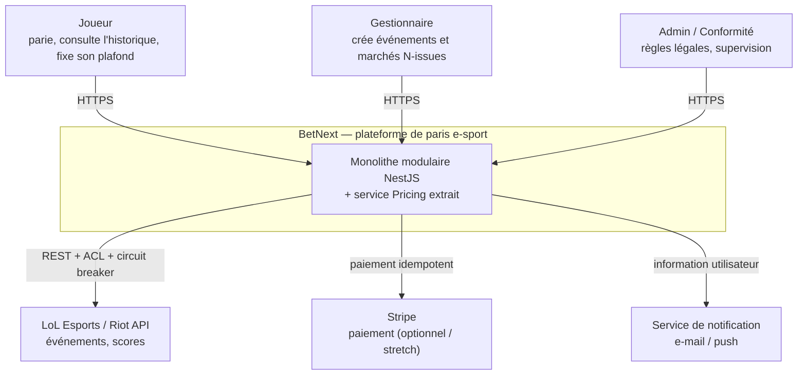
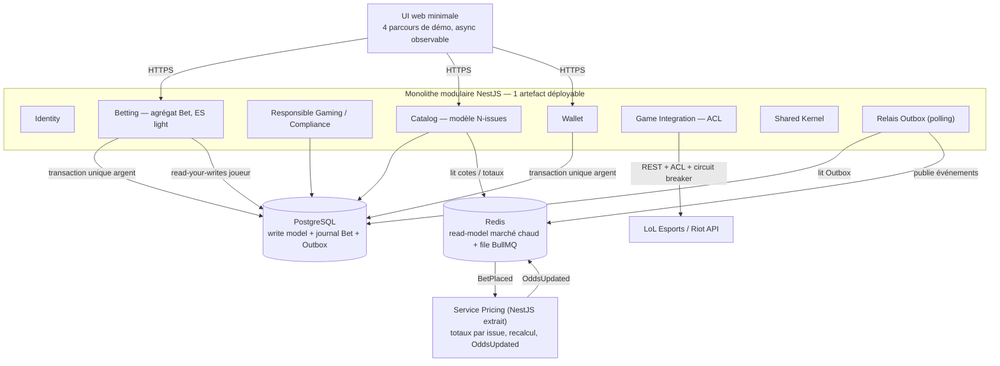
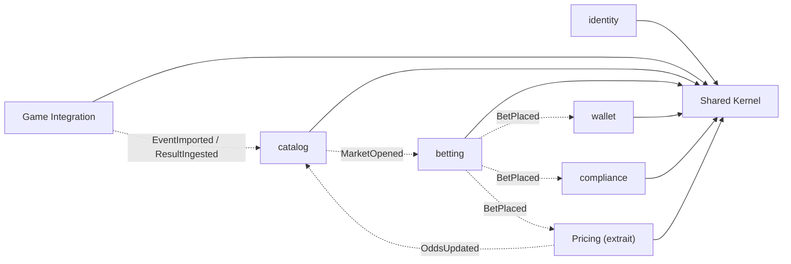
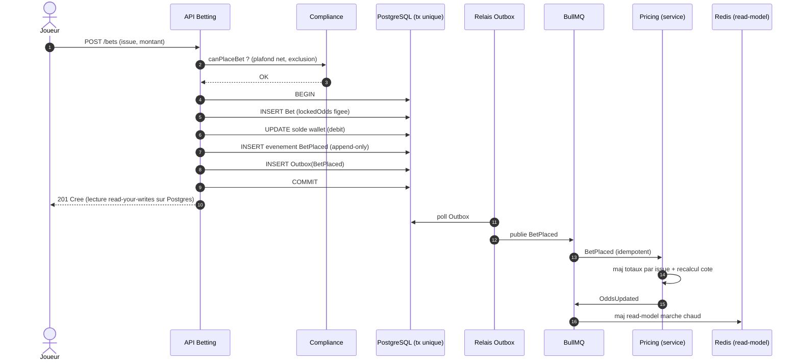
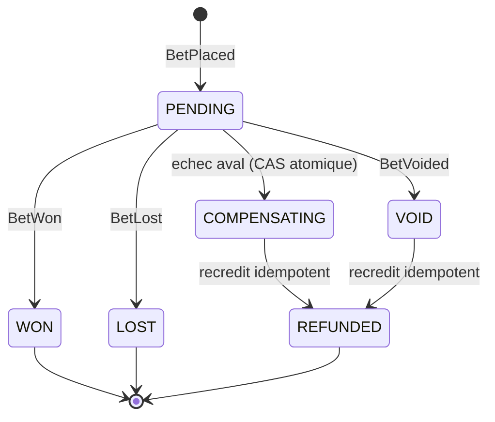

# BetNext — Diagrammes d'architecture cible

> Diagrammes Mermaid (rendus dans la plupart des visualiseurs Markdown). À lire avec `decisions.md` (les ADR référencés justifient chaque choix). Aucune donnée inventée : les flux reflètent les ADR-001 à 011.

## 1. C4 — Niveau 1 : contexte système

Qui parle à BetNext et avec quels systèmes externes.



## 2. C4 — Niveau 2 : conteneurs

Le monolithe (1 artefact) regroupe les bounded contexts ; **Pricing** est extrait (preuve de C3). L'argent est atomique dans **un seul** Postgres (ADR-003) ; Redis ne porte que le marché chaud (ADR-006).



## 3. Bounded contexts & frontières « ready-to-split »

Dépendances de **code** autorisées uniquement vers le Shared Kernel (trait plein) ; tout le reste passe en **événements** asynchrones (pointillés). Un import direct entre modules **casse le build** (`dependency-cruiser`, ADR-008/ADR-001).



*Légende :* trait plein = dépendance de code (vers Shared Kernel seulement) ; pointillés = événement via bus/Outbox. Wallet et Betting partagent la même base Postgres (atomicité argent, ADR-003) : ils ne sont donc **pas** indépendamment déployables — la frontière de preuve C3 est **Pricing**.

## 4. Flux nominal `placeBet` (wallet par défaut, atomique)

Le chemin d'écriture est minimal et **atomique** (ADR-003) ; la cote est **figée** (ADR-007) ; le recalcul est **asynchrone et hors transaction** (ADR-002/007).



*Note : si Pricing est indisponible, `placeBet` réussit quand même (la cote reste figée sur la dernière valeur publiée). C'est l'argument de découplage de l'ADR-007.*

## 5. Flux `placeBet` **en erreur de paiement** (Saga + compensation + recrédit + notification)

Cas du **paiement externe** (Stripe / future séparation du Wallet). Exigence « zéro perte » : si l'utilisateur paie et qu'une étape échoue → **corriger, informer, recréditer** (ADR-004). Idempotence côté consommateur, Circuit Breaker sur Stripe, **job de réconciliation** en filet de sécurité (ADR-008).

```mermaid
sequenceDiagram
    autonumber
    actor J as Joueur
    participant S as Saga (orchestrateur)
    participant ST as Stripe
    participant W as Wallet
    participant B as Betting
    participant N as Notification
    participant DB as PostgreSQL

    J->>S: Depot + pari (montant)
    S->>ST: Charge (cle idempotence)
    alt Charge refusee ou timeout (Circuit Breaker ouvert)
        ST-->>S: echec
        S->>N: "Paiement refuse, aucun debit"
        S-->>J: Echec (rien preleve)
    else Charge acceptee
        ST-->>S: OK (paiement encaisse)
        S->>W: Crediter le wallet (idempotent)
        W->>DB: tx credit + processed_messages
        S->>B: placeBet (cote figee)
        alt Etape pari echoue
            B-->>S: erreur
            Note over S,W: Compensation (recredit, pas un rollback)
            S->>W: Rembourser le depot (compensation idempotente)
            W->>DB: tx refund + processed_messages
            S->>N: "Erreur apres paiement : vous etes rembourse"
            S-->>J: Corrige et rembourse
        else Pari pose
            B->>DB: tx (Bet + evenement + Outbox)
            S->>N: "Pari confirme"
            S-->>J: 201 Confirme
        end
    end
    Note over S,DB: Reconciliation periodique : somme(transactions) = solde ; tout debit a sa contrepartie
```

*Garde anti double-crédit :* la transition `PENDING -> COMPENSATING` est appliquée en **compare-and-set atomique** ; un pari déjà `WON`/`LOST` refuse la compensation (ADR-004).

## 6. Cycle de vie de l'agrégat Bet (journal append-only, ES light)

Chaque transition émet un **événement immuable** (ADR-005) ; l'état courant (snapshot) fait autorité pour la lecture et le settlement, le journal sert d'audit et de rejeu.



*Settlement polymorphe (ADR-009) : `SettlementStrategy` produit un statut d'issue riche (`WON`/`LOST`/`VOID`/`PARTIAL`) au lieu du booléen `isWinner()` du legacy (`BettingService.php:80`), pour absorber un jeu non-binaire ou un nouveau type de pari.*
