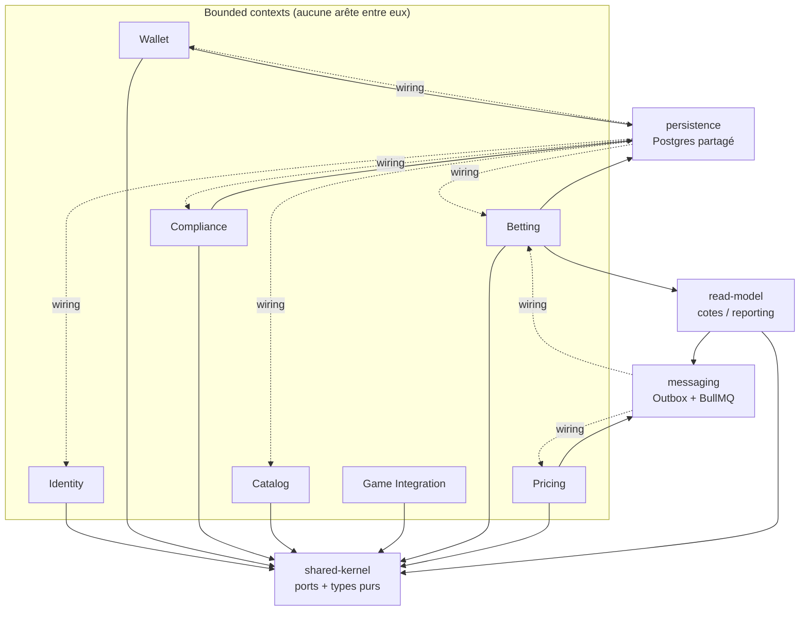
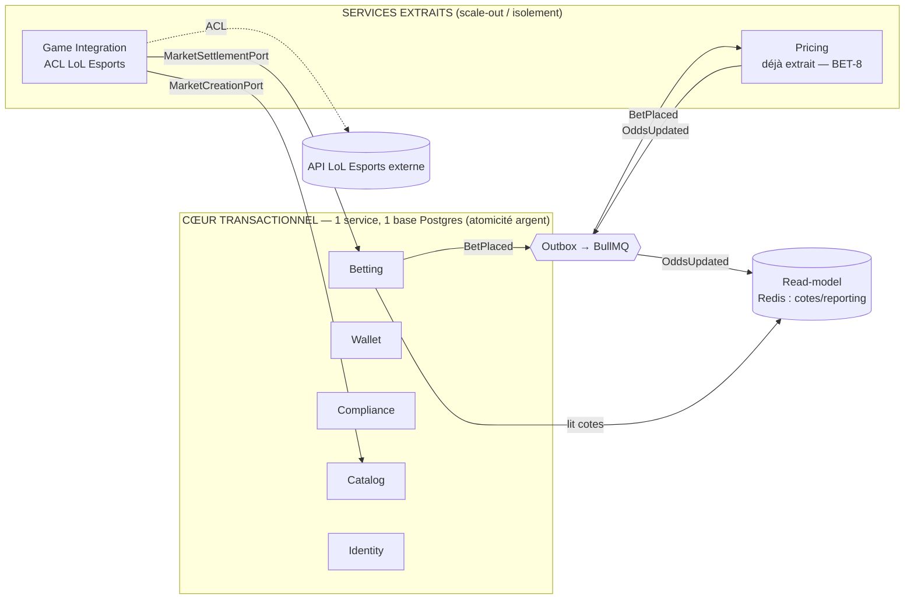

# BetNext — Évolution vers les microservices : validation « ready-to-split »

> **Livrable noté** — source complète unique. (`docs/architecture/microservices-evolution.md`
> n'est qu'un pointeur vers ce fichier.) Les chemins `fichier:ligne` sont relatifs à la racine
> du dépôt.

> Ticket : **BET-24**. Base : `origin/main` @ `fde52d4`.
> Posture : architecte. Ce document **valide la thèse** « monolithe modulaire prêt à
> découper en microservices » en l'**ancrant dans le code réel** (fichiers cités,
> règles de frontières effectives, graphe de dépendances généré). Aucune affirmation
> n'est posée sans preuve dans le repo. Complète les ADR de `decisions.md`
> (notamment ADR-001, ADR-002, ADR-003, ADR-008) — il n'y a pas de redite : ici on
> regarde la **topologie cible** et l'**ordre d'extraction**.

---

## 1. État des lieux (preuve par le code)

### 1.1 Les 8 contextes bornés réels

7 modules de domaine dans `src/contexts/` + le **Shared Kernel** (`src/shared-kernel/`)
= les 8 bounded contexts annoncés (ADR-001). Chacun est un module Nest autonome, importé
une seule fois dans la racine `src/app.module.ts:18-32`.

| # | Contexte | Module | Rôle | Persistance propre ? |
|---|----------|--------|------|----------------------|
| 1 | **Identity** | `src/contexts/identity/identity.module.ts` | Auth, RBAC, vérification de token | oui (Postgres) |
| 2 | **Wallet** | `src/contexts/wallet/wallet.module.ts` | Solde, ledger signé, réconciliation | oui (Postgres) |
| 3 | **Compliance** | `src/contexts/compliance/compliance.module.ts` | Plafond de mise, garde responsable | oui (Postgres) |
| 4 | **Catalog** | `src/contexts/catalog/catalog.module.ts` | Marchés N-issues, création de marché | oui (Postgres) |
| 5 | **Betting** | `src/contexts/betting/betting.module.ts` | `placeBet`, settlement, historique, stats | oui (Postgres) |
| 6 | **Pricing** | `src/contexts/pricing/pricing.module.ts` | Calcul de cote pari-mutuel | **non — état dérivé via bus (Redis)** |
| 7 | **Game Integration** | `src/contexts/game-integration/game-integration.module.ts` | ACL LoL Esports, featuring de matchs, settlement live | non (store en mémoire / lien) |
| 8 | **Shared Kernel** | `src/shared-kernel/` | Types purs + **ports** inter-contextes | n/a |

Le Shared Kernel ne contient **que** des primitives de domaine sans techno
(`Odds`, `OpeningOdds`, `DomainEvent`, `DomainError`, idempotence) et les **6 ports**
qui matérialisent les coutures entre contextes (`src/shared-kernel/ports/`) :

- `WalletDebitPort`, `WalletCreditPort` — chemin argent (Betting → Wallet) ;
- `StakeGuardPort` — garde de plafond (Betting → Compliance) ;
- `MarketCreationPort` — création de marché (Game Integration → Catalog) ;
- `MarketSettlementPort` — règlement (Game Integration → Betting) ;
- `TokenVerifierPort` — vérification d'auth (HTTP → Identity).

### 1.2 Pricing est **déjà extrait** (le patron de découpe)

Pricing n'est pas seulement un module : c'est le module dont l'extraction est **déjà
réalisée** (BET-8, ADR-002). Deux points d'entrée distincts existent dans le repo :

- `src/main.ts` — le monolithe HTTP (`npm start`) ;
- `src/pricing.main.ts` — un **process séparé** (`npm run start:pricing`,
  `package.json:13`) qui **ne parle que par le bus** : il refuse de démarrer sans
  `REDIS_URL` (`src/pricing.main.ts:15-20`), consomme la file `DOMAIN_EVENTS_QUEUE`,
  republie sur `ODDS_QUEUE` via BullMQ (`:24-31`). Il n'importe **aucune** base
  Betting — il maintient ses propres totaux par issue (`RedisPricingStore`).

C'est la **preuve falsifiable** exigée par ADR-001 : une frontière réseau réelle +
Outbox + état propre, pas un slogan.

### 1.3 Frontières vérifiées en CI par dependency-cruiser

Config réelle : `.dependency-cruiser.cjs` (script `npm run boundaries`,
`package.json:20`). **5 règles `error`** cassent le build à toute violation :

| Règle | Ce qu'elle interdit (fichier `.dependency-cruiser.cjs`) |
|-------|----------------------------------------------------------|
| **`no-cross-context`** | Un contexte importe le code interne d'un autre (`:3-16`). La comm inter-contexte passe par événements/ports, jamais par import direct. |
| **`domain-stays-pure`** | `domain/` dépend de `application/`, `infrastructure/` ou `@nestjs` (`:17-24`). |
| **`domain-no-tech`** | `domain/` touche une techno concrète : `typeorm`, `pg`, `ioredis`, `bullmq`, `express`, `opossum`… (`:25-34`). |
| **`application-no-infra`** | `application/` dépend d'un adapter `infrastructure/` concret (`:35-42`). |
| **`application-no-tech`** | `application/` dépend d'une techno concrète (seul `@nestjs` CQRS/DI toléré) (`:43-52`). |

**Résultat à `fde52d4` :**

```
✔ no dependency violations found (287 modules, 858 dependencies cruised)
```

→ **287 modules, 858 dépendances, 0 violation** (`error: 0, warn: 0`).

### 1.4 Graphe de dépendances réel (preuve « ready-to-split »)

Graphe extrait du JSON dependency-cruiser, agrégé par contexte. **Fait central :
il n'existe AUCUNE arête `contexte → contexte`.** Toutes les dépendances sortantes
d'un contexte vont vers une couche partagée (ports, bus, persistance, lecture).



Arêtes réelles (sortie brute, agrégée) :

```
ctx:betting          -> persistence, read-model, shared, shared-kernel
ctx:catalog          -> shared, shared-kernel
ctx:compliance       -> persistence, shared, shared-kernel
ctx:game-integration -> shared, shared-kernel
ctx:identity         -> shared, shared-kernel
ctx:pricing          -> messaging, shared-kernel        # ← aucune persistance : stateless-via-bus
ctx:wallet           -> persistence, shared, shared-kernel
messaging            -> ctx:betting, ctx:pricing        # wiring (composition)
persistence          -> ctx:{betting,catalog,compliance,identity,wallet}, messaging  # entités/migrations
read-model           -> messaging, shared-kernel
shared               -> shared-kernel
```

Lectures clés du graphe :

- **`pricing → {messaging, shared-kernel}` uniquement** : Pricing ne touche jamais la
  persistance. C'est pourquoi son extraction (1.2) a été la moins risquée — confirmé
  par le code, pas postulé.
- Les arêtes **inverses** `persistence → ctx:*` et `messaging → ctx:*` sont du
  **wiring de composition root** (la couche persistance déclare les entités/migrations
  de chaque contexte, le bus câble les handlers). Ce sont **les coutures à défaire**
  lors d'une extraction : on les liste explicitement au §3.
- `betting → persistence` **et** `wallet → persistence` partagent **la même base** :
  c'est le couplage volontaire d'ADR-003 (atomicité argent). C'est la raison pour
  laquelle Wallet+Betting **ne se découpent pas** sans changer la garantie money-safety.

---

## 2. Topologie cible

L'objectif n'est **pas** « 8 services ». C'est **regrouper par cohésion et par
contrainte money-safety**, et n'isoler que ce qui a une vraie raison de l'être
(scalabilité indépendante, isolement d'un tiers, cadence de déploiement propre).



| Cible | Contextes | Justification |
|-------|-----------|---------------|
| **Service « cœur transactionnel »** | Betting, Wallet, Compliance, Catalog, Identity | **Cohésion + money-safety.** Betting↔Wallet partagent une transaction Postgres (ADR-003) ; les séparer recrée un dual-write sur l'argent. Compliance (garde de plafond, `StakeGuardPort`), Catalog (`MarketCreationPort`) et Identity sont à faible débit et fortement co-sollicités sur le chemin d'écriture → restent groupés. Le découpage interne reste **logique** (modules + ports), prêt à promouvoir si le besoin survient. |
| **Service Pricing** *(extrait)* | Pricing | **Scalabilité (C1) + déploiement indépendant (C3) d'un même geste.** Composant chaud, `O(nb paris)`, quasi-stateless, alimenté **uniquement par événements**. Scale-out par N workers. Déjà prouvé (1.2). |
| **Service Game Integration** *(candidat n°1)* | Game Integration | **Isolement d'un tiers.** ACL + résilience (circuit breaker, timeout/retry) autour de l'API LoL Esports (`game-integration.module.ts:31-46`). Cadence de déploiement dictée par un tiers ≠ celle du cœur. I/O-bound, pas sur le chemin argent. |
| **Read-model** *(déjà séparable)* | (infra, pas un contexte) | Redis = cache reconstructible des cotes/reporting public (ADR-006). Alimenté par `OddsUpdated`. Scale en lecture indépendamment. |

**Ce qui NE devient PAS un service (et pourquoi c'est un choix, pas un manque) :**
Wallet seul — l'isoler casserait l'atomicité (ADR-003) ; on l'assume. La C3 est prouvée
sur **les frontières qui ont une raison métier** (Pricing, Game Integration), pas sur
les 8 par dogme.

---

## 3. Ordre d'extraction argumenté

Critère de priorisation = **(valeur de découpe) ÷ (risque × couplage sortant)**. On
extrait d'abord ce qui apporte le plus en touchant le moins au chemin argent.

### Étape 0 — Pricing *(FAIT — BET-8)*

- **Ce qui bouge** : `src/pricing.main.ts` tourne déjà comme process séparé.
- **Communication** : consomme `DOMAIN_EVENTS_QUEUE` (`BetPlaced`), publie `ODDS_QUEUE`
  (`OddsUpdated`) sur BullMQ/Redis.
- **Money-safety** : **aucune** — Pricing ne touche pas l'argent. Cote **figée à la
  pose** (`lockedOdds`), donc un Pricing en panne n'altère pas un pari déjà posé
  (ADR-007). Idempotence consommateur sur `BetPlaced` (`processed_messages`, ADR-008).
- **Pourquoi en premier** : couplage sortant minimal (`→ messaging, shared-kernel`
  seulement, cf. graphe §1.4), zéro état persistant, plus forte valeur C1+C3.

### Étape 1 — Game Integration *(recommandée, optionnelle dans le POC)*

- **Ce qui bouge** : `GameIntegrationModule` → process autonome. Il ne dépend que de
  `shared` + `shared-kernel` (graphe §1.4), et consomme **deux ports** déjà en place :
  `MarketCreationPort` (vers Catalog) et `MarketSettlementPort` (vers Betting).
- **Communication** : aujourd'hui ces ports sont des adapters in-process
  (`CatalogMarketCreation` côté Catalog, `CommandBusMarketSettlement` côté Betting).
  À l'extraction, on remplace **l'adapter, pas le port** : `IngestMatchMarket` et
  `SyncMatchResult` continuent d'appeler `MarketCreationPort` / `MarketSettlementPort` ;
  seule l'implémentation devient un appel réseau (HTTP) ou un événement (`MatchSettled`
  via Outbox). Le domaine et l'application ne changent pas — **c'est exactement la
  promesse de l'hexagonal**.
- **Money-safety** : le settlement crédite les gagnants via `WalletCreditPort` côté
  Betting, **dans la transaction de Betting**. Game Integration ne fait que
  *déclencher* le règlement (`MarketSettlementPort.settle`) ; l'atomicité du crédit
  reste **dans le cœur**. Garanties préservées : crédit exactement-une-fois
  (idempotence), réconciliation (ADR-013) inchangée car l'argent ne traverse jamais la
  frontière réseau.
- **Pourquoi en deuxième** : valeur réelle (isole un tiers instable), risque modéré
  (passe d'un appel synchrone à un appel réseau/asynchrone sur le settlement), couplage
  sortant déjà capté par 2 ports.

### Étape 2 — (théorique) promotion d'un sous-domaine du cœur

Non recommandée dans le POC. Si un jour Catalog ou Compliance devait scaler/déployer
seul : il est déjà isolé derrière son port (`MarketCreationPort` / `StakeGuardPort`).
La seule couture à défaire serait **la base partagée** (`persistence → ctx:*`, §1.4) :
il faudrait lui donner son schéma propre et remplacer les lectures cross-contexte par
des événements. Tant que le chemin n'est pas sur l'argent, c'est mécanique. Wallet
reste le cas **à ne pas** extraire (ADR-003).

### Mécanisme générique d'une extraction (résumé)

| Couture en place | Avant extraction | Après extraction |
|------------------|------------------|------------------|
| Port shared-kernel (`Market*Port`, `Wallet*Port`, `StakeGuardPort`) | adapter in-process | adapter HTTP **ou** événement Outbox — port inchangé |
| Bus intra-module | `@nestjs/cqrs` in-process | `MarketCreated`/`BetPlaced`/`OddsUpdated`/`MatchSettled` via Outbox→BullMQ |
| Atomicité argent | 1 transaction Postgres | **reste dans le cœur** — jamais déplacée derrière le réseau |
| Idempotence | `processed_messages` (consommateur) | identique, obligatoire at-least-once |
| Réconciliation | ledger signé `Σ=solde` (ADR-013) | identique, l'Outbox ne transporte pas d'argent |

---

## 4. Preuve par l'existant

1. **Pricing (BET-8) = patron d'extraction déjà réalisé.** Process séparé
   (`pricing.main.ts`), communication 100 % par bus, état dérivé propre. C'est la
   réponse vivante à « un monolithe peut-il vraiment se découper ? ».
2. **Game Integration via ports shared-kernel.** Le code consomme **déjà**
   `MarketCreationPort` et `MarketSettlementPort` (`game-integration.module.ts:55-67`)
   sans connaître Catalog ni Betting. L'extraction = changer l'adapter, pas le métier.
3. **Coutures génériques en place** prouvées par le graphe (§1.4) : Outbox + BullMQ
   (`src/messaging/`), idempotence consommateur (`processed_messages`,
   `IdempotentMessageHandler`), ports + ACL, read-model découplé (`read-model → messaging`),
   ledger de réconciliation (ADR-013).
4. **2ᵉ extraction = optionnelle.** Une mini-preuve (un `game-integration.main.ts`
   symétrique de `pricing.main.ts`) serait rapide et sûre, **mais elle n'est pas
   committée ici** : à valider avec Baptiste avant tout code (le POC prouve déjà C3
   avec une frontière ; la seconde est un *plus*, pas un prérequis de soutenance).

---

## 5. Risques & limites (périmètre POC) + reste-à-faire prod

### Limites assumées du POC

- **C3 prouvée sur 1 frontière** (Pricing). Wallet/Betting restent co-déployés par
  choix d'atomicité (ADR-003) — angle d'attaque n°1 du jury, **assumé**.
- **Base Postgres partagée** par le cœur (`persistence → ctx:*`). « Ready-to-split »
  est vrai au niveau **code/frontières** (0 violation), pas encore au niveau
  **données** pour le cœur (volontaire).
- **Game Integration** garde un store en mémoire (`InMemoryMatchLinkStore`) — à
  persister avant une vraie extraction.
- Cohérence **éventuelle** des cotes (ADR-007), tenable en pré-match seulement.

### Ce qui resterait pour un vrai run prod

- **Transactions distribuées** : à l'extraction de toute écriture argent, basculer en
  Saga orchestrée + compensation (ADR-004) — non requis tant que l'argent reste dans
  le cœur.
- **Observabilité** : tracing distribué (corrélation `BetPlaced → OddsUpdated`),
  métriques de lag de file, dead-letter queue, **alerting** sur dérive de réconciliation
  (aujourd'hui rapport sans correction, ADR-013).
- **Déploiement** : un artefact/CI par service extrait, contrats d'événements
  versionnés (upcasting, ADR-005), schémas de base isolés, montée en charge par paliers
  (ADR-012).
- **Bus** : BullMQ/Redis suffit jusqu'au palier 2 ; au-delà, log partitionné
  (Kafka/Redpanda) — **pas avant** (calibrage junior, ADR-012).

---

## 6. Verdict

La thèse « monolithe modulaire ready-to-split » est **validée par le code réel**, pas
par l'intention :

- **0 arête contexte→contexte** sur 287 modules / 858 dépendances, **0 violation**
  des 5 règles dependency-cruiser → les frontières sont réelles et tenues en CI.
- Les coutures de découpe (**ports shared-kernel, Outbox/BullMQ, idempotence,
  read-model, ledger**) sont **en place et exercées**, pas hypothétiques.
- L'extraction est **déjà démontrée** (Pricing) et **reproductible** (Game Integration
  via ports), avec les garanties money-safety **préservées par conception** (l'argent
  ne traverse jamais une frontière réseau).

*Sources internes vérifiées :* `.dependency-cruiser.cjs`, `src/app.module.ts`,
`src/pricing.main.ts`, `src/contexts/*/`*.module.ts*, `src/shared-kernel/`,
`src/messaging/`, `src/read-model/`, sortie `npm run boundaries` @ `fde52d4`.
*Décisions de référence :* `docs/architecture/decisions.md` (ADR-001/002/003/004/006/007/008/013).
