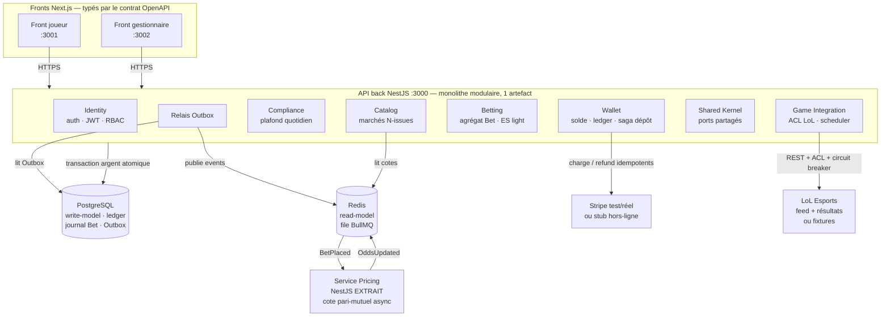
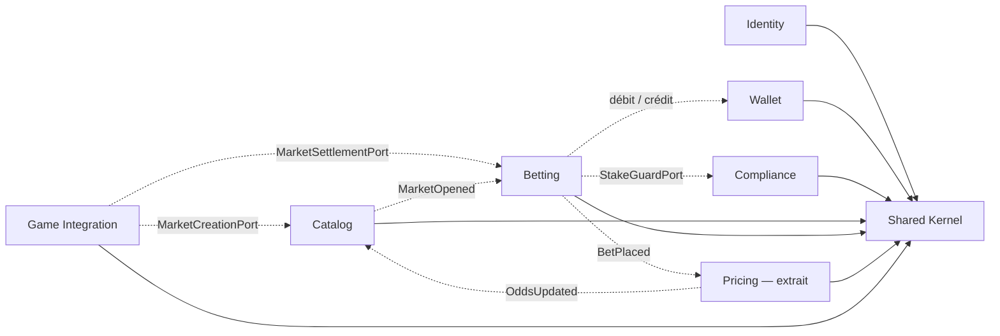
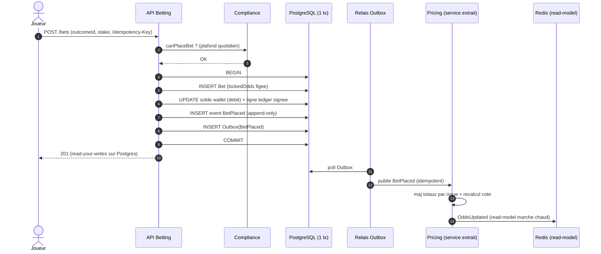
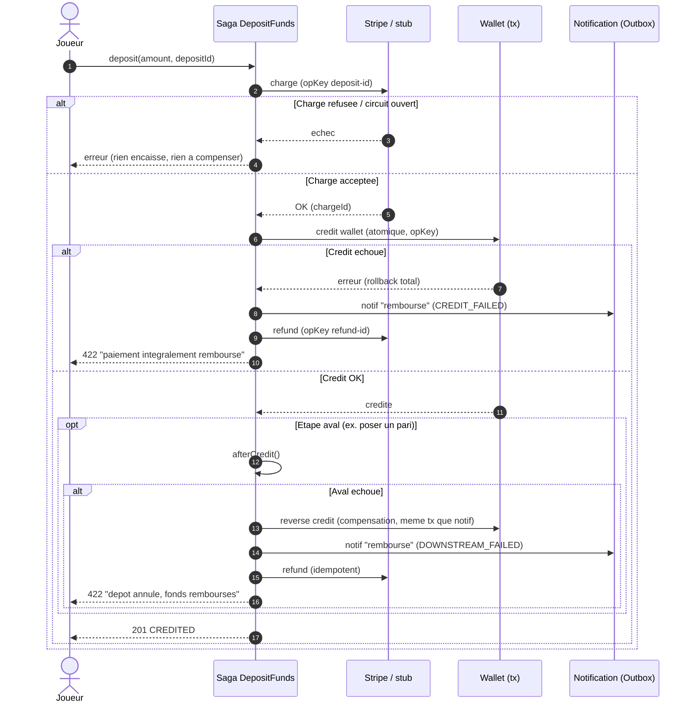
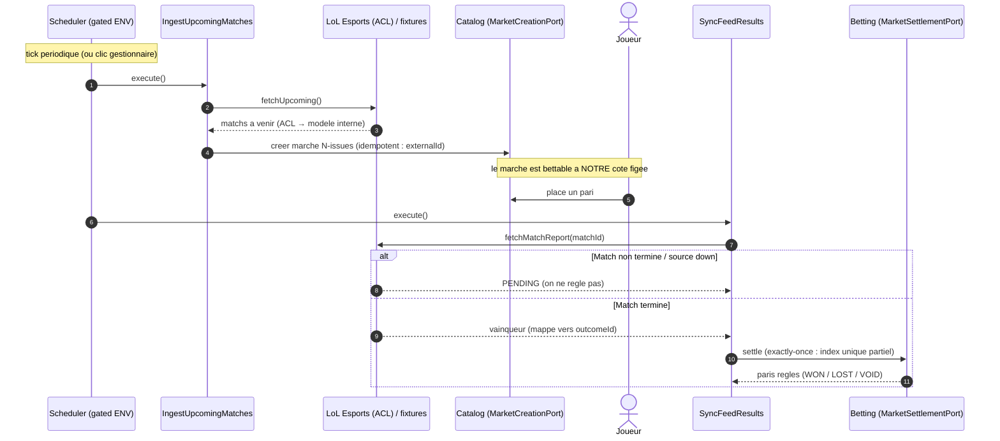

# BetNext — Synthèse visuelle : architecture & design patterns

> **Document capstone.** Vue d'ensemble *visuelle* du système réellement implémenté, des
> design patterns employés (chacun pointé dans le vrai code) et des spécificités techniques.
> Le pendant pratique est le [Guide d'utilisation](guide-utilisation.md).
>
> Ce document **ne duplique pas** les références existantes, il les **relie** :
> - [`README.md`](../README.md) — démarrage et endpoints détaillés, ticket par ticket ;
> - [`docs/architecture/decisions.md`](../docs/architecture/decisions.md) — les **ADR** (justifications & compromis) ;
> - [`docs/architecture/diagrams.md`](../docs/architecture/diagrams.md) — diagrammes C4 & flux détaillés ;
> - [`livrables/analyse-microservices.md`](analyse-microservices.md) — pourquoi *un seul* module extrait ;
> - [`livrables/plan-formation.md`](plan-formation.md) — montée en compétence de l'équipe ;
> - [`livrables/support-archi.md`](support-archi.md) — slides de la formation (≈ 20 min) ;
> - [`livrables/demo-soutenance.md`](demo-soutenance.md) — les 4 scénarios de démo.

---

## 1. Vue d'ensemble

BetNext est un **monolithe modulaire NestJS « ready-to-split »** : un module = un *bounded
context*, frontières dures vérifiées en CI. Pour **prouver** le déploiement indépendant
(contrainte 3 du sujet), **un** module — **Pricing** — est réellement **extrait** en
microservice NestJS (process séparé, communication bus-only). Deux fronts Next.js (un par
rôle) consomment l'API via un **contrat OpenAPI généré** ; l'infra se résume à **PostgreSQL**
(write-model + argent) et **Redis** (read-model + file BullMQ).

| Élément | Réalité du POC |
|---|---|
| **7 contextes métier + Shared Kernel** | Identity · Wallet · Compliance · Catalog · Betting · Pricing · Game Integration · **Shared Kernel** |
| **Module extrait** | **Pricing** (`src/pricing.main.ts`, lancé par `npm run start:pricing`) — preuve « ready-to-split » |
| **2 fronts** | Joueur (`web/apps/player`, :3001) · Admin/gestionnaire (`web/apps/admin`, :3002) |
| **Contrat d'API** | OpenAPI généré (`npm run openapi:generate`) → types front (`packages/api-contract`, `npm run api:contract`) |
| **Infra** | PostgreSQL (argent atomique) + Redis (cache marché chaud + BullMQ) |
| **Externe (optionnel)** | Stripe (stub sans clé) · feed LoL Esports (fixtures sans clé) |

### Diagramme — architecture globale

> **Lecture money-safety :** seule la flèche `back → pg` porte de l'argent, et toujours dans
> **une** transaction. Redis et BullMQ ne transportent que des **événements**, jamais des euros
> (ADR-003, ADR-006).

---

## 2. Design patterns — où, pourquoi, dans quel fichier

Chaque pattern est ancré sur un fichier réel. Les ADR (entre crochets) en portent la
justification et le compromis assumé.

| Pattern | En une phrase | Où dans le code | ADR |
|---|---|---|---|
| **Monolithe modulaire** | 1 module Nest = 1 contexte, frontières testées | `src/contexts/*` + `.dependency-cruiser.cjs` | 001 |
| **Hexagonal (ports/adapters)** | domaine pur → ports → adapters d'infra | `*/domain`, `*/application/ports`, `*/infrastructure` | 001 |
| **CQRS** | écriture minimale (commands) vs lecture (read-model) | `@nestjs/cqrs` : `PlaceBetHandler`, `GetBetHistoryHandler` | 006 |
| **Event Sourcing ciblé** | journal append-only du seul agrégat `Bet` | `betting/.../BetEventRecord.ts`, migration `InitBetting` | 005 |
| **Saga + compensation** | dépôt orchestré : charge → crédit → compensation idempotente | `wallet/application/DepositFunds.ts` | 004 |
| **Transactional Outbox** | l'event est écrit *dans la même tx* → pas de dual-write | `messaging/Outbox*.ts`, `betting/.../OutboxRecord.ts` | 008 |
| **Idempotence** | clé HTTP + consommateur idempotent (exactly-once) | `betting/.../IdempotentPlaceBet.ts`, `messaging/IdempotentMessageHandler.ts`, `messaging/ProcessedMessageRecord.ts` | 008 |
| **ACL anti-corruption** | le modèle externe LoL n'entre jamais brut dans le domaine | `game-integration/infrastructure/esports/*` | 016, 017 |
| **Strategy** | +1 type de pari = +1 stratégie de règlement, cœur inchangé | `betting/domain/settlement/*Strategy.ts` | 009 |
| **Factory** | sélectionne la stratégie par clé (`strategyKey`) | `betting/application/SettlementStrategyFactory.ts` | 009 |
| **Repository** | persistance derrière une interface, infra interchangeable | `betting/.../TypeOrmBetRepository.ts` vs `InMemoryBetRepository.ts` | 001 |
| **Shared-kernel ports** | coutures inter-contextes (jamais d'import direct) | `src/shared-kernel/ports/*` | 014 |
| **Circuit Breaker / Timeout / Retry** | durcit les appels externes (Stripe, LoL) | `shared/resilience/*`, `wallet/.../ResilientPaymentGateway.ts`, `game-integration/.../Resilient*Provider.ts` | 004, 016 |
| **Scheduler (adapter horloge)** | déclencheur temporel des use cases, gated ENV | `game-integration/.../scheduler/EsportsFeedScheduler.ts` | 018 |

### 2.1 Hexagonal — la forme de chaque contexte

Tout contexte respecte la même anatomie : `domain` (logique pure, zéro I/O) → `application`
(use cases + **ports** = interfaces) → `infrastructure` (**adapters** = TypeORM, HTTP, Redis,
Stripe…). Le domaine ne connaît jamais NestJS ni la base. Conséquence directe : le même use
case tourne **in-memory** en test (`InMemoryBetRepository`) et **sur Postgres** en prod
(`TypeOrmBetRepository`), sans changer une ligne de domaine.

### 2.2 CQRS — séparer écriture et lecture

`placeBet` est une **commande** au chemin d'écriture minimal (INSERT pari + event). La cote
courante se lit dans un **read-model Redis** (`src/read-model/*`), jamais dans la base
d'écriture. Les données joueur (solde, historique) sont servies en *read-your-writes* sur
Postgres. Redis est un **cache reconstructible**, jamais autoritaire.

### 2.3 Shared-kernel ports — les coutures inter-contextes

Les contextes ne s'importent **jamais** entre eux : ils dialoguent par des ports déclarés
dans le Shared Kernel et résolus par injection NestJS.

| Port | Producteur → Consommateur | Rôle |
|---|---|---|
| `MarketCreationPort` | Game Integration → Catalog | créer un marché depuis le feed |
| `MarketSettlementPort` | Game Integration / Betting | régler un marché (polymorphe) |
| `StakeGuardPort` | Betting → Compliance | vérifier le plafond avant pari |
| `WalletDebitPort` / `WalletCreditPort` | Betting / saga → Wallet | mouvements d'argent |
| `TokenVerifierPort` | Identity → tout contexte protégé | vérifier le JWT |
| `PaymentGateway` | Wallet → Stripe/stub | charge & refund externes |
| `GameProvider` | Game Integration → LoL Esports | récupérer un résultat de match |

---

## 3. Spécificités techniques

### 3.1 Money-safety (le fil rouge)

- **Atomicité — 1 transaction.** Débit wallet + pari + événements + ligne Outbox dans **une
  seule** transaction Postgres → tout-ou-rien (ADR-003). Prouvé sur vrai Postgres :
  `npm run test:atomicity:pg`.
- **Cote figée au pari.** `lockedOdds` est gravée à la pose : un recalcul concurrent ne
  modifie **jamais** un pari déjà posé (ADR-007).
- **Ledger signé + réconciliation.** Chaque mouvement écrit une ligne signée dans
  `wallet_operations` *dans la même tx* que le solde → invariant **Σ(mouvements) = solde**.
  `GET /admin/reconciliation` **rapporte** les dérives, en lecture seule, **sans
  auto-correction** (ADR-013). Prouvé : `npm run test:reconciliation:pg`.
- **Exactly-once.** Côté HTTP (`Idempotency-Key`) et côté consommateur
  (`processed_messages`). Le règlement est garanti **exactly-once** par un **index unique
  partiel** sur `bet_events` (un seul `BetWon`/`BetLost`/`BetVoided` par pari, migration
  `InitBetSettlementGuard`) : un rejeu est un no-op.

### 3.2 Sécurité — RBAC & anti-IDOR

Autorité **100 % serveur** (ADR-015) : `JwtAuthGuard` + `RolesGuard` + `@Roles(...)`
(`src/shared/auth/*`). Le `userId` est **toujours** pris du token, jamais du corps de requête
(anti-usurpation). Un PLAYER sur une route MANAGER → **403** ; pas de token → **401**. Front
**scindé par rôle** pour matérialiser la frontière côté UI.

### 3.3 Frontières « ready-to-split » vérifiées en CI

`dependency-cruiser` (`npm run boundaries`) **casse le build** à tout import inter-contexte ou
à tout domaine qui touche l'infra. La frontière n'est pas une convention : c'est un **test**
qui échoue. C'est ce qui rend l'extraction de Pricing crédible — et celle d'un autre module,
demain, mécanique.

### 3.4 Feed LoL Esports + règlement auto + scheduler

- **Ingestion** (ADR-016) : les matchs pro à venir entrent via un **ACL** ; nos cotes restent
  calculées par **notre** pricing (aucune cote externe). Idempotent (un `externalId` déjà lié
  est ignoré).
- **Résultats** (ADR-017) : le port `GameProvider` récupère le résultat ; le marché et les
  paris sont réglés **exactly-once**. **Pas** de bascule live→fixtures côté résultats : on ne
  règle **jamais** sur de fausses données (source down → `PENDING`, on réessaie).
- **Scheduler** (ADR-018) : un déclencheur temporel léger (`EsportsFeedScheduler`) ré-ingère +
  synchronise sans clic. **OFF par défaut** (`ESPORTS_SCHEDULER_ENABLED`) → jamais armé en
  test/CI. Il ne fait que **rappeler** les use cases (zéro logique argent).

### 3.5 Stripe stub vs réel

Sans `STRIPE_SECRET_KEY` → `StubPaymentGateway` déterministe (démo & CI hors-ligne). Avec une
clé `sk_test_…` → adapter Stripe **réel** (mode test), durci par circuit breaker + timeout +
retry (`ResilientPaymentGateway`). La clé est secrète : jamais en dur, jamais loggée.

---

## 4. Carte des contextes & dépendances

Trait plein = dépendance de **code** (uniquement vers le Shared Kernel). Pointillés =
**événement** asynchrone (bus / Outbox) ou appel **via port**. Un import direct entre modules
**casse le build**.

> Wallet et Betting partagent **le même** Postgres (atomicité de l'argent) : ils ne sont donc
> **pas** indépendamment déployables — la preuve C3 est portée par **Pricing**, qui ne touche
> pas l'argent. Voir [`analyse-microservices.md`](analyse-microservices.md).

---

## 5. Flux money — `placeBet` en une transaction

Chemin d'écriture minimal et **atomique** ; cote **figée** ; recalcul **asynchrone et hors
transaction**.

> Si Pricing est indisponible, `placeBet` **réussit quand même** (la cote reste figée). C'est
> l'argument de découplage (ADR-007).

---

## 6. Saga dépôt Stripe — charge → crédit → compensation

Exigence « zéro perte » : si le joueur paie et qu'une étape échoue → **corriger, informer,
recréditer**. Compensation **idempotente**, ordre money-safe (on défait le crédit *avant* de
rendre l'argent au PSP). Source : `wallet/application/DepositFunds.ts` (ADR-004).

> **Garde anti double-mouvement :** `opKey` dérivée de `depositId` → un rejeu (retry réseau)
> ne double ni la charge ni le refund. Prouvé : scénario 4 de
> [`demo-soutenance.md`](demo-soutenance.md).

---

## 7. Cycle du feed — ingestion → pari → résultat → règlement auto

Du match pro à venir jusqu'au pari réglé tout seul. L'ACL isole le modèle externe ;
l'idempotence et l'exactly-once tiennent même sous re-pull / re-sync.

> Sans clé esports, tout le cycle tourne sur **fixtures déterministes** (un match « terminé »
> est fourni pour démontrer le règlement auto hors-ligne). Détails : ADR-016 → 018.

---

## 8. Ce qui est prouvé vs ce qui est conçu

| ✅ Prouvé (tests réels) | 🧭 Conçu, non implémenté |
|---|---|
| Atomicité argent — Postgres (`test:atomicity:pg`) | `BetTypeStrategy` au **placement** + payout `PARTIAL` |
| Réconciliation Σ = solde — Postgres (`test:reconciliation:pg`) | Pricing **multi-marchés** simultanés |
| Cote async + idempotence — Redis (`test:pricing:redis`, `test:outbox:redis`) | — |
| Frontières (`npm run boundaries`, 0 violation) | |
| Auth JWT + RBAC + anti-IDOR (BET-20) | |
| Feed LoL + règlement auto exactly-once (BET-30/32/33) | |
| Saga dépôt Stripe + compensation + circuit breaker (BET-17) | |
| Settlement : 2 stratégies réelles (`WINNING_OUTCOME` + `EXACT_SCORE`) | |

La valeur d'un POC d'architecte, c'est aussi de **distinguer** ces deux colonnes. Pour le
*comment faire tourner tout ça*, enchaînez sur le **[Guide d'utilisation](guide-utilisation.md)**.
